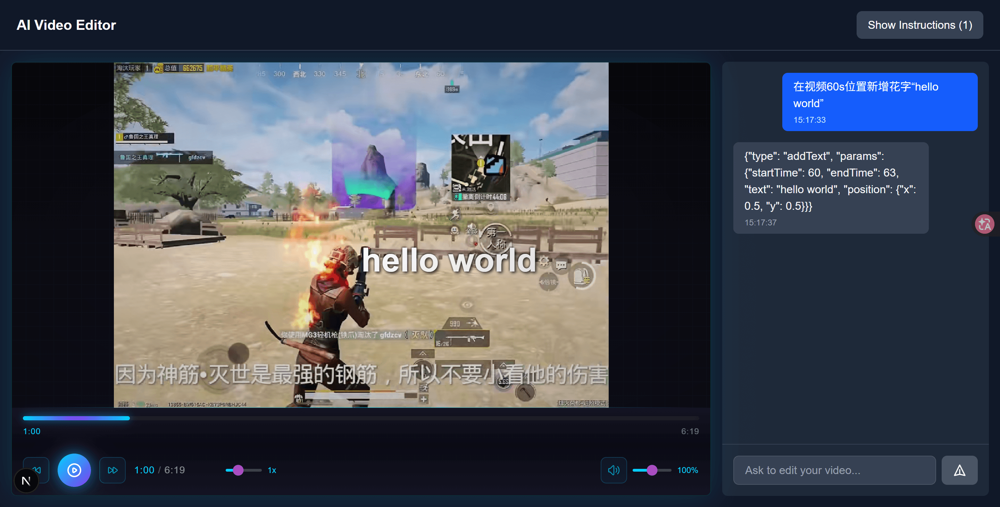
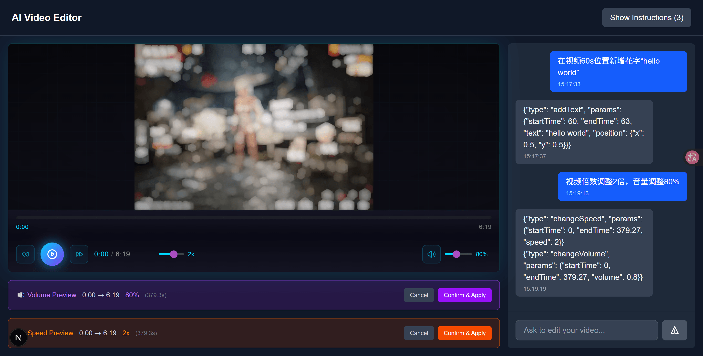
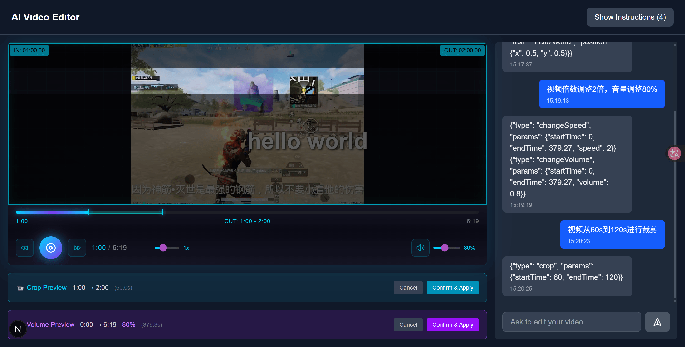
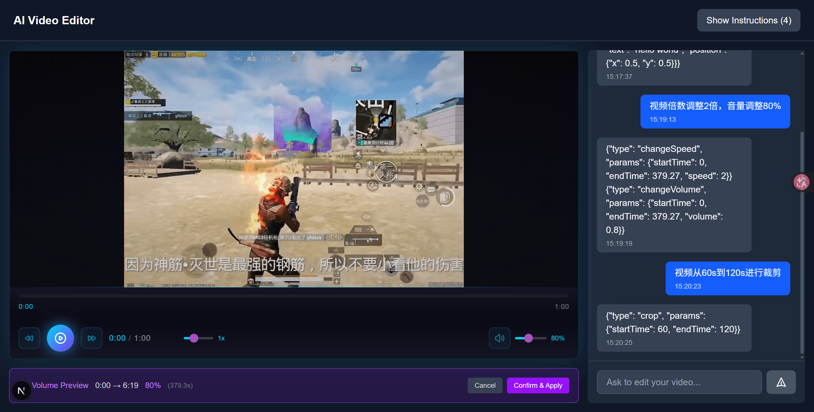
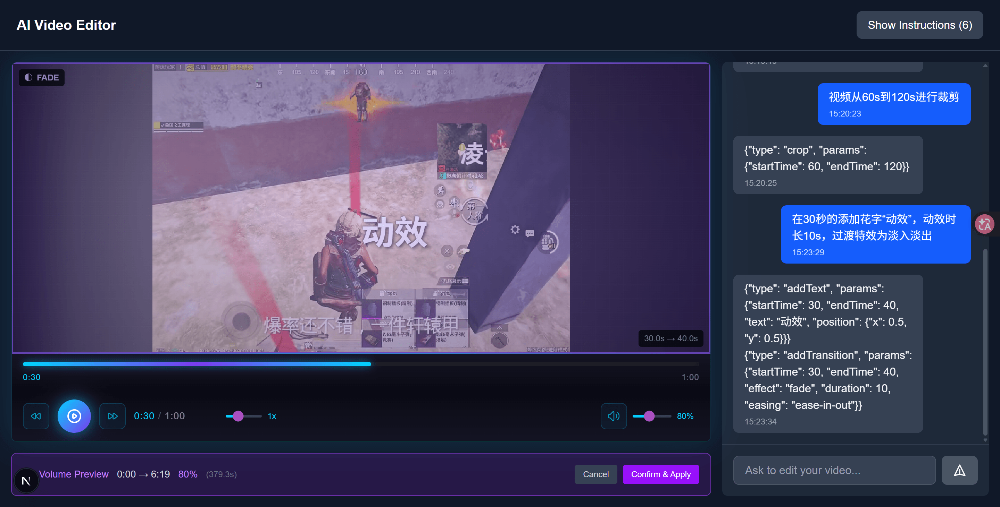
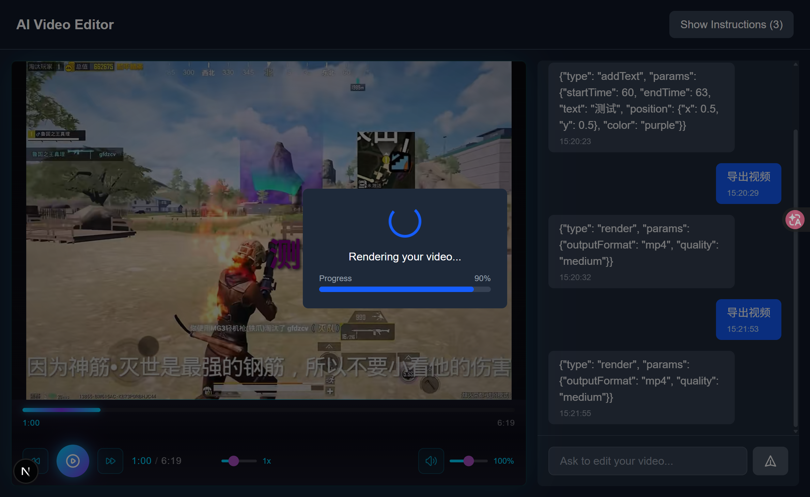
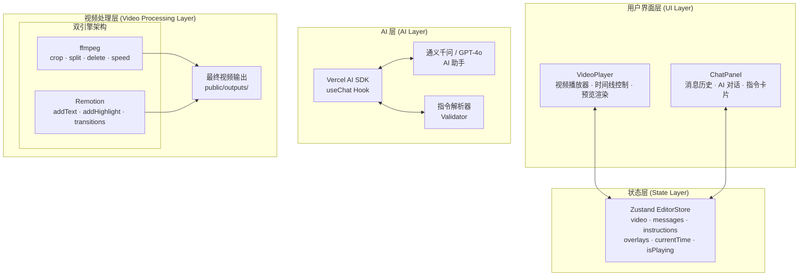
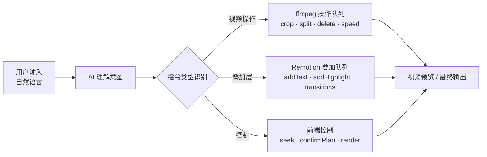

# AI Video Editing Agent (Remotion Agent)

> 一个智能 AI 驱动的视频编辑助手，通过自然对话协作编辑视频

[](https://nextjs.org/)
[](https://sdk.vercel.ai/)
[](https://www.remotion.dev/)
[](https://ffmpeg.org/)

---

## 目录

- [快速开始](#快速开始)
- [架构总览](#架构总览)
- [核心概念](#核心概念)
- [设计理念](#设计理念)
- [适用场景](#适用场景)
- [技术栈](#技术栈)
- [指令系统](#指令系统)
- [API 设计](#api-设计)
- [架构文档](./docs/superpowers/specs/2026-03-22-architecture.md)

---

## 快速开始

```bash
# 安装依赖
pnpm install

# 启动开发服务器
pnpm run dev

# 生产构建
pnpm run build
```

环境变量：

```bash
OPENAI_API_KEY=your_api_key    # OpenAI API Key（可选，已默认使用通义千问）
ALIBABA_API_KEY=your_key       # 阿里云 API Key（默认已配置）
ALIBABA_BASE_URL=https://dashscope.aliyuncs.com/compatible-mode/v1
```

---

## 效果演示

以下是 AI Video Editing Agent 的主要功能演示：

### 1. 智能视频上传与分析



### 2. 自然语言指令编辑



### 3. 实时预览与调整



### 4. 叠加层效果展示



### 5. 最终渲染输出



### 6. 导出视频展示



---

## 架构总览

> 完整架构文档包含更详细的架构图、数据流程图和时序图：[架构文档](./docs/superpowers/specs/2026-03-22-architecture.md)

### 系统架构图



### 数据流架构图



---

## 核心概念

### 双引擎架构

本项目采用**双引擎架构**处理视频编辑任务：

| 引擎         | 职责         | 处理内容                         |
| ------------ | ------------ | -------------------------------- |
| **ffmpeg**   | 底层视频操作 | 裁剪、分割、删除、变速、格式转换 |
| **Remotion** | 叠加层渲染   | 文字、花字、高亮、转场、特效     |

```
输入视频 → ffmpeg (底层编辑) → 中间视频 → Remotion (叠加层) → 最终视频
```

### 指令系统

指令分为三类，由不同引擎处理：

| 类型         | 指令                                             | 引擎      |
| ------------ | ------------------------------------------------ | --------- |
| **视频操作** | `crop`, `splitClip`, `deleteClip`, `changeSpeed` | ffmpeg    |
| **叠加层**   | `addText`, `addHighlight`, `addTransition`       | Remotion  |
| **控制**     | `seek`, `confirmPlan`, `render`                  | 前端/后端 |

---

## 设计理念

### 1. 自然语言驱动的视频编辑

传统视频编辑软件需要用户学习复杂的操作界面和快捷键。本项目采用**自然语言交互**：

```
用户："把第5秒到15秒的片段加速2倍，然后加上'精彩瞬间'的文字"
AI：  {"type": "crop", "params": {"startTime": 5, "endTime": 15}},
      {"type": "changeSpeed", "params": {"startTime": 5, "endTime": 15, "speed": 2}},
      {"type": "addText", "params": {"startTime": 5, "endTime": 15, "text": "精彩瞬间", ...}}
```

**核心理念**：用户描述意图，AI 解析并执行专业操作。

### 2. 确认-执行模式

所有 AI 生成的指令都需要用户确认后才执行：

```
┌─────────────────────────────────────────────────────────┐
│  AI: 我建议执行以下操作：                                 │
│  ┌─────────────────────────────────────────────────────┐ │
│  │ [裁剪] 5s → 15s                                     │ │
│  │ [变速] 2x 加速                                      │ │
│  │ [加文字] "精彩瞬间" @ 位置(0.5, 0.8)                 │ │
│  └─────────────────────────────────────────────────────┘ │
│                                                         │
│  [确认执行]  [修改参数]  [取消]                          │
└─────────────────────────────────────────────────────────┘
```

**核心理念**：AI 辅助但不替代用户决策。

### 3. 分层渲染架构

视频编辑分为两个独立层次：

```
┌─────────────────────────────────────────────────────────┐
│                    叠加层 (Remotion)                     │
│   ┌─────────────────────────────────────────────────┐   │
│   │  ▓▓▓▓▓▓▓▓▓▓▓▓▓▓▓▓▓▓▓▓▓▓▓▓▓▓▓▓▓▓▓▓▓▓▓▓▓▓▓▓▓▓▓   │   │
│   │  ▓  文字: "精彩瞬间"              ▓  高亮区域  ▓   │   │
│   │  ▓                                  ▓    ▓▓▓▓▓   ▓   │   │
│   │  ▓▓▓▓▓▓▓▓▓▓▓▓▓▓▓▓▓▓▓▓▓▓▓▓▓▓▓▓▓▓▓▓▓▓▓▓▓▓▓▓▓▓▓   │   │
│   └─────────────────────────────────────────────────┘   │
├─────────────────────────────────────────────────────────┤
│                    底层视频 (ffmpeg)                      │
│   ┌─────────────────────────────────────────────────┐   │
│   │                                                   │   │
│   │     ▶ ████████████████░░░░░░░░░░░░░░░░░░░░░░     │   │
│   │                                                   │   │
│   └─────────────────────────────────────────────────┘   │
└─────────────────────────────────────────────────────────┘
```

**核心理念**：底层编辑与叠加层分离，各自独立修改。

### 4. 实时预览能力

支持两种预览模式：

| 模式         | 触发条件                      | 渲染方式           |
| ------------ | ----------------------------- | ------------------ |
| **快速预览** | 简单操作（如 seek、单个文字） | 即时预览，无需等待 |
| **完整渲染** | 复杂操作（多个叠加层、变速）  | Remotion 完整渲染  |

---

## 适用场景

### 1. 内容创作者场景

**适用人群**：YouTuber、Vlogger、直播切片编辑

**典型需求**：

- 快速添加字幕和花字
- 裁剪精彩片段
- 变速处理（慢动作、快进）
- 批量添加品牌水印

**用户价值**：无需学习专业软件，通过对话即可完成编辑

---

### 2. 教育培训场景

**适用人群**：在线课程制作者、培训师

**典型需求**：

- 重点片段高亮标注
- 讲解要点文字叠加
- 章节时间线标记
- 变速播放（1.5x、2x）

**用户价值**：快速制作专业感的学习视频

---

### 3. 企业内部场景

**适用人群**：市场部、培训部、内部沟通

**典型需求**：

- 快速剪辑会议录像
- 添加水印和品牌元素
- 制作产品演示视频
- 自动化处理批量视频

**用户价值**：降低视频编辑门槛，提升工作效率

---

### 4. AI 应用集成场景

**适用人群**：AI 应用开发者、视频平台

**典型需求**：

- 集成到现有产品
- 自动化视频处理流水线
- 定制化指令集
- 批量处理工作流

**技术价值**：模块化设计，易于集成扩展

---

### 5. 不适用场景

| 场景           | 原因                                 |
| -------------- | ------------------------------------ |
| 精细化专业剪辑 | 需要关键帧、遮罩、多轨编辑等专业功能 |
| 实时协作编辑   | 当前为单用户架构                     |
| 超长视频处理   | 受限于预览/渲染性能                  |
| 复杂特效包装   | 建议使用 After Effects               |

---

## 技术栈

| 类别         | 技术                            | 用途                       |
| ------------ | ------------------------------- | -------------------------- |
| **框架**     | Next.js 15 (App Router)         | Web 应用框架               |
| **AI**       | Vercel AI SDK + 通义千问/GPT-4o | 自然语言处理               |
| **视频底层** | ffmpeg                          | 裁剪、分割、变速、格式转换 |
| **视频叠加** | Remotion                        | 文字、特效、转场动画       |
| **状态管理** | Zustand                         | 前端状态管理               |
| **样式**     | Tailwind CSS                    | UI 样式                    |

---

## 指令系统

### 完整指令列表

| 指令            | 类型     | 参数                                 | 说明                |
| --------------- | -------- | ------------------------------------ | ------------------- |
| `seek`          | 控制     | `time: number`                       | 跳转到指定时间点    |
| `crop`          | ffmpeg   | `startTime, endTime`                 | 裁剪视频片段        |
| `splitClip`     | ffmpeg   | `startTime, endTime`                 | 分割视频片段        |
| `deleteClip`    | ffmpeg   | `startTime, endTime`                 | 删除片段            |
| `changeSpeed`   | ffmpeg   | `startTime, endTime, speed`          | 变速（0.5x, 2x 等） |
| `addText`       | Remotion | `startTime, endTime, text, position` | 添加文字叠加        |
| `addHighlight`  | Remotion | `startTime, endTime, color`          | 高亮时间段          |
| `addTransition` | Remotion | `startTime, endTime, type`           | 添加转场效果        |
| `confirmPlan`   | 控制     | `confirmed: boolean`                 | 确认/取消计划       |
| `render`        | 控制     | `outputFormat, quality`              | 触发渲染            |

---

## API 设计

### 端点总览

| 方法   | 路径                  | 说明         |
| ------ | --------------------- | ------------ |
| `POST` | `/api/video/upload`   | 上传视频文件 |
| `POST` | `/api/chat`           | 发送对话消息 |
| `POST` | `/api/preview`        | 生成预览     |
| `POST` | `/api/render`         | 开始渲染任务 |
| `GET`  | `/api/render/[jobId]` | 查询渲染状态 |

### 请求/响应示例

```typescript
// POST /api/chat
// Request
{
  "videoId": "video_abc123",
  "messages": [
    { "role": "user", "content": "把5到10秒加速2倍" }
  ]
}

// Response
{
  "response": "好的，我将把5-10秒的片段加速2倍。",
  "instruction": {
    "type": "changeSpeed",
    "params": { "startTime": 5, "endTime": 10, "speed": 2 }
  }
}
```

---

## 项目结构

```
remotion-agent/
├── src/
│   ├── app/                      # Next.js App Router
│   │   ├── api/                  # API 路由
│   │   │   ├── chat/route.ts    # 对话 API
│   │   │   ├── video/           # 视频相关 API
│   │   │   └── render/          # 渲染任务 API
│   │   ├── layout.tsx
│   │   └── page.tsx
│   ├── components/                # React 组件
│   │   ├── VideoPlayer/          # 视频播放器
│   │   ├── ChatPanel/            # 对话面板
│   │   ├── Editor/               # 编辑器主组件
│   │   └── UploadZone/           # 上传区域
│   ├── lib/                      # 工具库
│   │   ├── instructions/         # 指令系统
│   │   ├── remotion/            # Remotion 配置
│   │   ├── ai/                  # AI 配置
│   │   └── video/                # 视频处理
│   └── stores/                   # Zustand 状态
│       └── editorStore.ts
├── public/
│   ├── uploads/                  # 上传视频存储
│   └── outputs/                  # 渲染输出
├── docs/                         # 文档
│   └── specs/                    # 设计规范
├── package.json
└── README.md
```

---

## 许可证

MIT License
