# AI Video Editing Agent - 架构文档

**日期**: 2026-03-22
**状态**: Complete

---

## 1. 系统架构图

### 1.1 整体架构

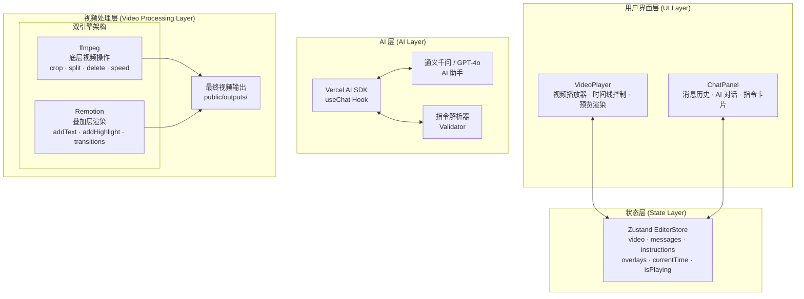

### 1.2 分层说明

| 层级 | 组件 | 职责 |
|------|------|------|
| **UI Layer** | VideoPlayer, ChatPanel | 用户交互、视频预览、消息展示 |
| **State Layer** | Zustand EditorStore | 集中管理应用状态 |
| **AI Layer** | Vercel AI SDK, LLM, Parser | 自然语言理解、指令生成 |
| **Video Layer** | ffmpeg, Remotion | 底层视频处理、叠加层渲染 |

---

## 2. 数据流程图

### 2.1 指令处理流程

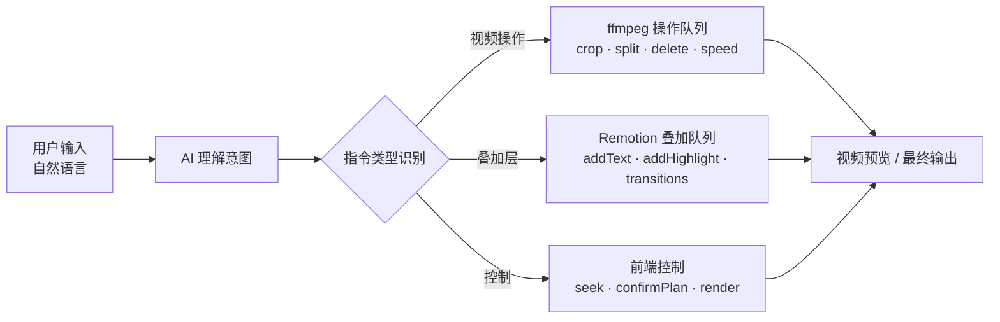

### 2.2 完整数据流

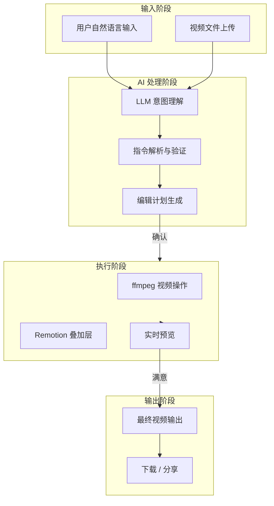

---

## 3. 时序图

### 3.1 典型编辑会话流程

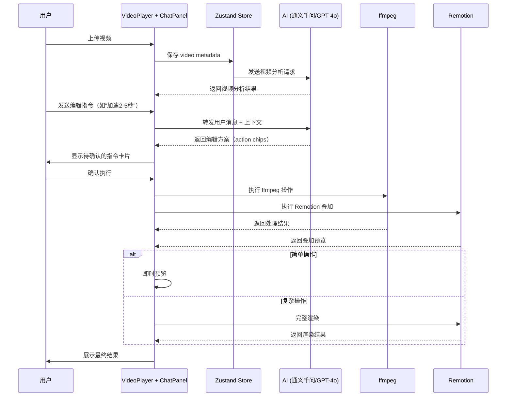

### 3.2 指令执行时序

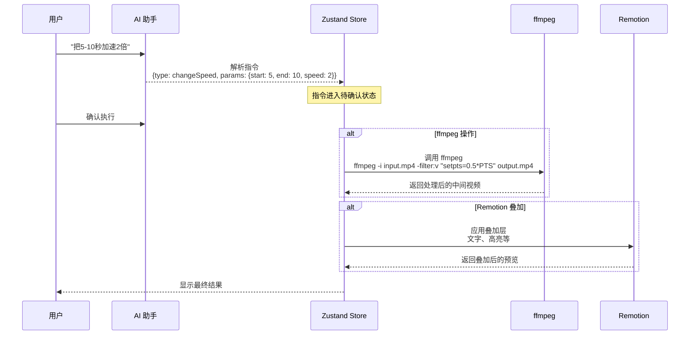

---

## 4. 组件关系图

### 4.1 前端组件关系

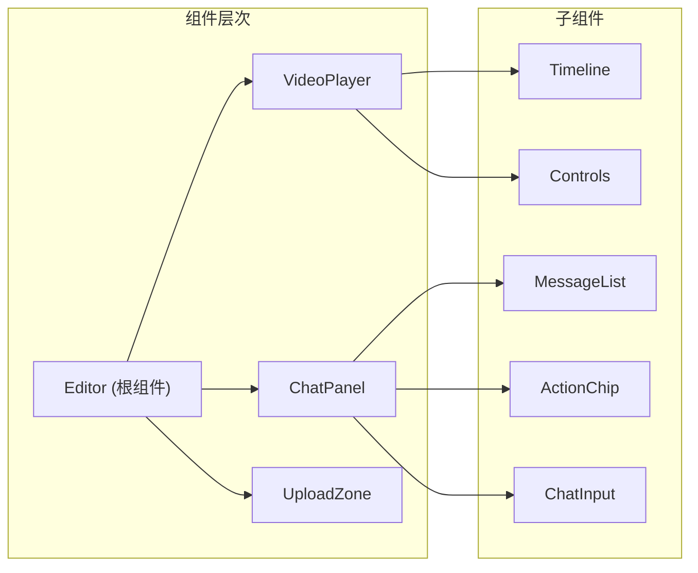

### 4.2 状态流向

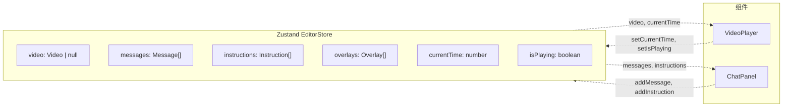

---

## 5. 双引擎架构详解

### 5.1 ffmpeg 与 Remotion 职责划分

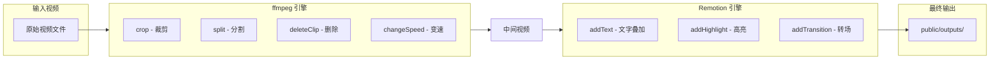

### 5.2 指令到引擎的映射

| 指令类型 | 引擎 | 处理内容 |
|----------|------|----------|
| `crop` | ffmpeg | 裁剪指定时间段 |
| `splitClip` | ffmpeg | 在指定时间点分割 |
| `deleteClip` | ffmpeg | 删除片段 |
| `changeSpeed` | ffmpeg | 变速处理 |
| `addText` | Remotion | 文字叠加层 |
| `addHighlight` | Remotion | 高亮区域标记 |
| `addTransition` | Remotion | 转场动画 |
| `seek` | 前端 | 跳转播放位置 |
| `confirmPlan` | 前端 | 确认编辑计划 |
| `render` | 后端 | 触发完整渲染 |

---

## 6. API 数据流

### 6.1 主要 API 端点

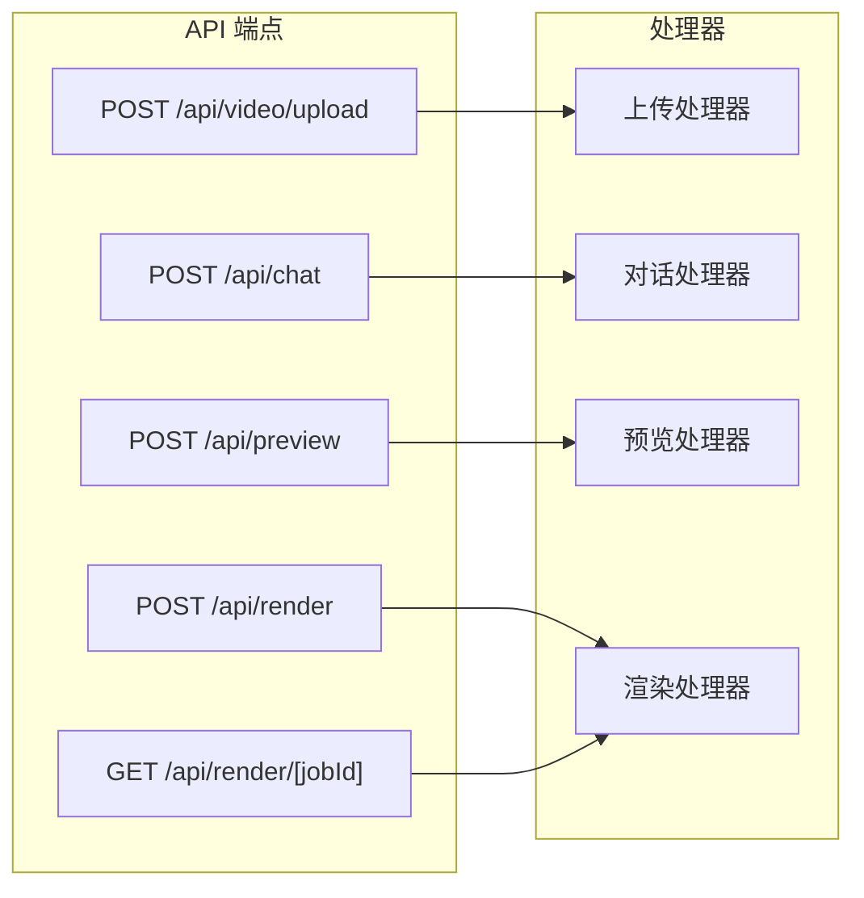

### 6.2 请求/响应模式

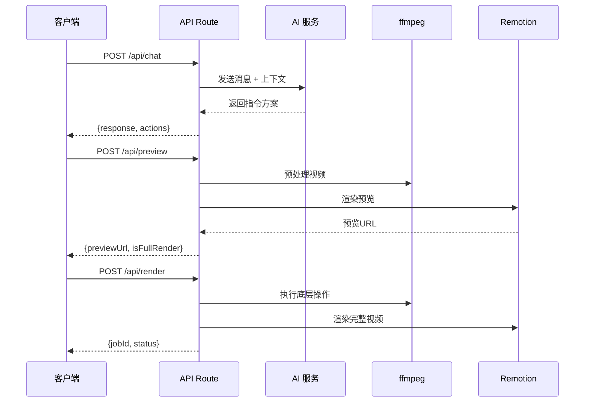

---

## 7. 文件结构与组件对应

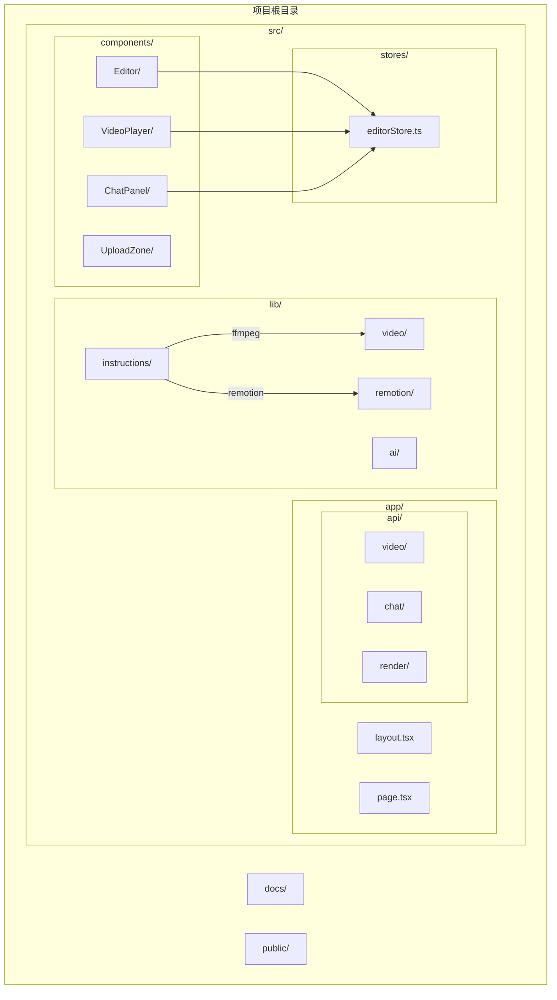
